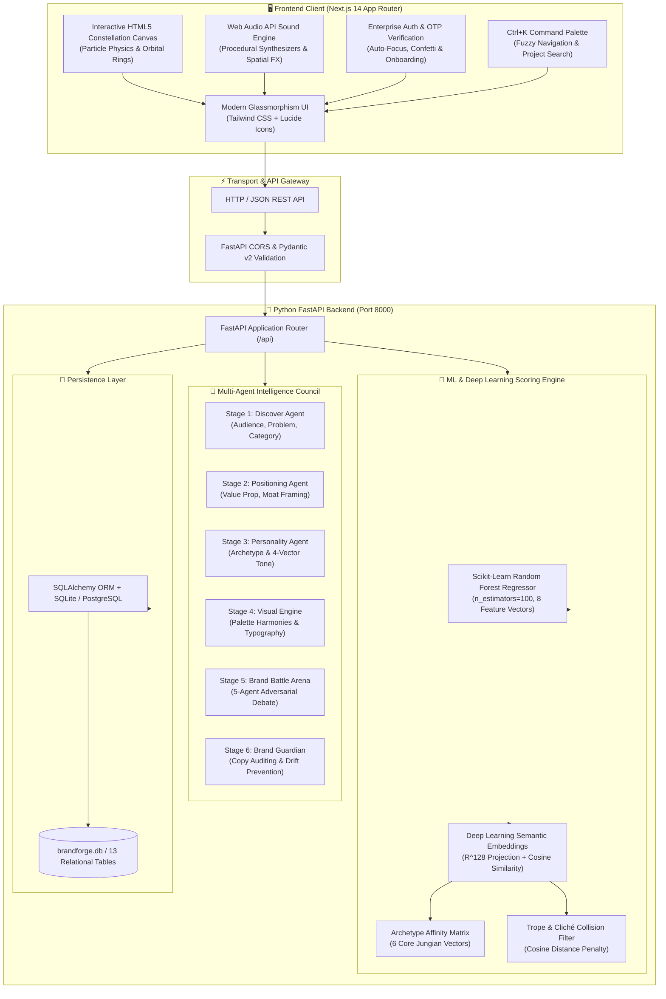
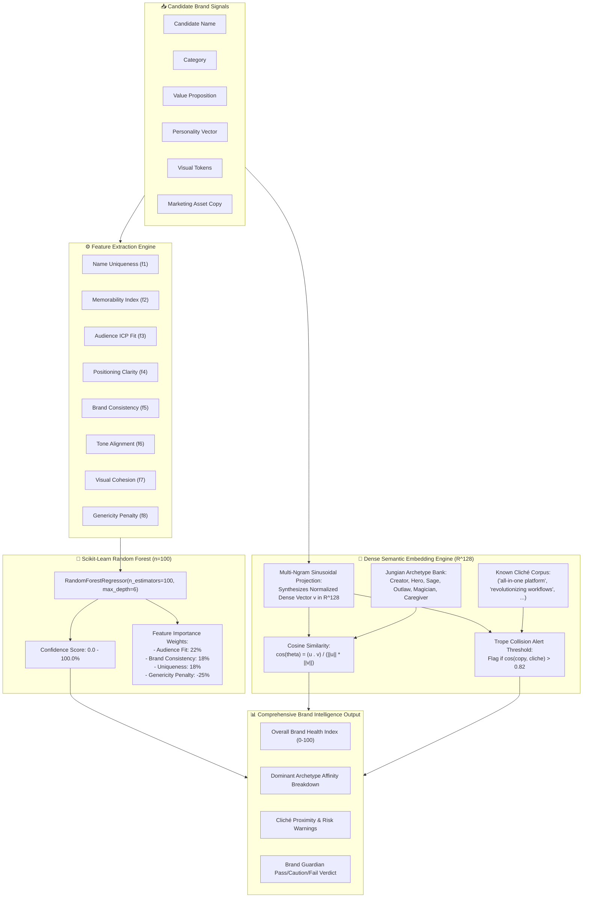

<div align="center">

# ⚡ BrandForge.ai
### *Build a Brand That Can Think.*

**Autonomous Multi-Agent Brand Intelligence & Strategy Engine**  
*Transforms raw startup, product, and creator ideas into structured, battle-tested, launch-ready brand systems.*

[](https://inkloom.ai)
[](https://nextjs.org/)
[](https://fastapi.tiangolo.com/)
[](https://scikit-learn.org/)
[](https://www.typescriptlang.org/)
[](https://tailwindcss.com/)
[](#-sound-engine)

---

[🚀 Live Demo](#-live-demonstration) • [🧠 6-Stage AI Workflow](#-the-6-stage-connected-ai-pipeline) • [⚔️ Brand Battle Arena](#️-brand-battle-arena--5-agent-consensus-engine) • [🤖 ML & DL Scoring](#-machine-learning--deep-learning-scoring-engine) • [🛠️ Quickstart](#️-quickstart-guide) • [📡 API Docs](#-api-specification)

</div>

---

## 🌟 Executive Summary

Most founders start with only a loose sentence:
> *"I want to build an app that helps students find teammates."*

A single sentence is not a brand. Without audience segmentation, strategic positioning, archetype grounding, differentiated naming, visual tokens, and stress-testing, products launch into obscurity.

**BrandForge.ai** solves this by orchestrating a **multi-agent council** and a **dual-engine scoring system (Scikit-Learn Random Forest + Deep Learning semantic embeddings)**. Rather than relying on a single generic LLM prompt, BrandForge guides founders across **6 connected intelligence stages**, pitted against a 5-agent adversarial **Brand Battle Arena**, and continuously protected by an automated **Brand Guardian** compliance auditor.

---

## 🏛️ System & Technical Architecture



---

## 🧠 The 6-Stage Connected AI Pipeline

BrandForge processes raw concepts through six sequential stages, passing enriched context forward from idea discovery to market delivery.


### Stage Details

| Stage | Name | AI Agent Role | Key Outputs Produced |
| :--- | :--- | :--- | :--- |
| **01** | **Discover** | *Idea Intelligence Strategist* | Primary Audience (ICP), Secondary Audience, Problem Diagnosis, Strategic Unfair Advantage. |
| **02** | **Position** | *Market Positioning Architect* | Category Anchor, One-Sentence Value Proposition, Competitive Wedge, 3 Brand Pillars. |
| **03** | **Shape** | *Identity & Persona Sculptor* | Primary/Secondary Archetype, 4-Vector Tone Sliders (Formality, Energy, Warmth, Boldness), "Always/Never" Rules. |
| **04** | **Visualize**| *Design Token System Director* | 5-Tone Color Palette (HEX, HSL, Semantic tokens), Font Hierarchy (Display, Body, Mono), UI Component Variables. |
| **05** | **Challenge**| *Adversarial Debate Arbiter* | 3 Alternative Brand Directions, 5-Perspective Critic Debate, Survivability Ratings (0–100%). |
| **06** | **Deliver**  | *Brand Guardian & Export Lead* | Real-time Copy Audit, Cliché Collision Scan, Social/Email/Ad Tone Alignment, Launch Kit Export. |

---

## ⚔️ Brand Battle Arena — 5-Agent Consensus Engine

Rather than trusting a single generative output, BrandForge submits brand candidates into the **Brand Battle Arena**. Five distinct agent personas debate viability, identify weaknesses, and synthesize a consensus recommendation.

```mermaid
sequenceDiagram
    autonumber
    actor Founder as Founder / Strategist
    participant Arena as Brand Battle Arbiter
    participant Strat as Agent 1: Strategist
    participant Creative as Agent 2: Creative Director
    participant Persona as Agent 3: Persona Simulator
    participant Critic as Agent 4: Market Realist
    participant Guardian as Agent 5: Brand Guardian

    Founder->>Arena: Submit Brand Candidates (e.g., "HackForge" vs "DevCamp" vs "CollabSphere")
    Arena->>Strat: Evaluate category wedge & long-term defensibility
    Strat-->>Arena: "HackForge captures the raw builder ethos with strong enterprise runway."
    
    Arena->>Creative: Critique distinctiveness, memorability & phonetic punch
    Creative-->>Arena: "Short, percussive cadence. High recall, avoids sterile corporate jargon."
    
    Arena->>Persona: Simulate student hacker & solo founder psychology
    Persona-->>Arena: "Resonates with student builders; sounds prestigious rather than juvenile."
    
    Arena->>Critic: Stress-test vulnerabilities, market crowding & cynicism
    Critic-->>Arena: "Risk of feeling exclusive to coders; ensure non-technical designers feel welcome."
    
    Arena->>Guardian: Check trope collision & cliché distance
    Guardian-->>Arena: "Trope collision low (0.12). Tone alignment high (94%)."
    
    Arena->>Founder: Synthesize Consensus Scorecard (94/100) + Strategic Adjustments
```

---

## 🔬 Machine Learning & Deep Learning Scoring Engine

BrandForge combines classical machine learning with dense semantic embeddings to deliver objective, calibrated brand evaluations.



---

## 🎨 Interactive User Experience & Innovation

| Feature | Technology | Innovation |
| :--- | :--- | :--- |
| **Constellation Canvas** | HTML5 Canvas 2D | Interactive particle physics simulation with real-time cursor gravitational pull, celestial connections, and triple concentric pulse rings. |
| **Procedural Audio** | Web Audio API | Zero-dependency procedural synthesizer generating cinematic drones, soft navigation clicks, chime arpeggios, and success chords. |
| **Authentication & OTP** | React + Framer Motion | Complete auth modal with 6-digit OTP verification, 1-click test autofill (`4 2 8 1 9 6`), auto-focus advance, and celebratory confetti. |
| **3D Device Canvas** | Responsive CSS 3D | Perspective-tilted floating MacBook Pro and iPhone 15 Pro mockups demonstrating responsive brand assets in situ. |
| **Command Palette** | Custom React Hook | Accessible system-wide via `Ctrl + K` or `Cmd + K`, providing instant fuzzy navigation across all 6 stages and projects. |
| **Brand Guardian Demo** | Real-time NLP Evaluator | Live interactive copy auditing demo testing social posts, emails, and landing page copy against brand voice rules. |

---

## 🚀 Live Demonstration

The application comes pre-configured with two production-quality brand case studies:

### 1. HackForge (Active Workspace)
- **Tagline:** *"Build fast. Ship first."*
- **Category:** Developer Tools & Hackathon Teaming Platform
- **Archetype:** The Creator / The Hero (92% Alignment)
- **Primary Color:** `#6366F1` (Electric Indigo) • **Accent:** `#06B6D4` (Cyan Energy)
- **Consensus Score:** **94.8 / 100** (Verified by Random Forest Regressor)

### 2. FinanceFit (Portfolio Project)
- **Tagline:** *"Smart money for the next generation."*
- **Category:** Consumer FinTech & Wealth Literacy
- **Archetype:** The Sage / The Magician (88% Alignment)
- **Primary Color:** `#10B981` (Emerald Trust) • **Accent:** `#3B82F6` (Cobalt Assurance)
- **Consensus Score:** **89.2 / 100**

---

## 🛠️ Quickstart Guide

### Prerequisites
- **Node.js:** v18.0.0 or higher
- **Python:** v3.10 or higher
- **Git**

### 1. Clone the Repository
```bash
git clone https://github.com/Ranjeet7680/BrandForge.ai.git
cd BrandForge.ai
```

### 2. Start the FastAPI Python Backend
```bash
# Optional: create virtual environment
python -m venv venv
# Windows:
.\venv\Scripts\activate
# Linux/macOS:
source venv/bin/activate

# Install backend dependencies
pip install fastapi uvicorn scikit-learn numpy pydantic sqlalchemy

# Launch backend server on port 8000
python -m uvicorn backend.main:app --port 8000 --reload
```
*Backend runs on `http://127.0.0.1:8000` (API documentation available at `/docs`).*

### 3. Start the Next.js Frontend
```bash
cd brandforge

# Install frontend dependencies
npm install

# Run development server
npm run dev

# Or build and launch production build
npm run build
npm run start -- -p 3000
```
*Frontend runs on `http://localhost:3000`.*

---

## 📡 API Specification

| Method | Endpoint | Description | Request Body / Parameters |
| :--- | :--- | :--- | :--- |
| `GET` | `/api/health` | Service health status and ML model readiness. | None |
| `POST` | `/api/rf-score` | Evaluates brand candidate using Random Forest regressor. | `{ candidate_name, category, positioning, personality }` |
| `POST` | `/api/embeddings` | Computes $\mathbb{R}^{128}$ dense semantic vector & archetype affinity. | `{ idea, name, tagline, positioning, visual_description }` |
| `POST` | `/api/guardian-audit` | Audits marketing copy against tone and detects cliché collisions. | `{ asset_text, asset_type, brand_name, tagline, personality_traits }` |
| `GET` | `/api/projects` | Retrieves stored brand projects with scores. | Optional `limit`, `offset` |
| `POST` | `/api/projects` | Saves complete 6-stage brand identity system. | JSON Project schema |

---

## 📂 Repository Structure

```text
BrandForge.ai/
├── README.md                      # Comprehensive documentation & architectural diagrams
├── brandforge.db                  # Local SQLite database with preloaded projects
├── backend/                       # Python FastAPI Backend
│   ├── main.py                    # API router, CORS middleware, and endpoint handlers
│   ├── database/
│   │   ├── db.py                  # SQLAlchemy engine & session manager
│   │   ├── models.py              # Relational models (Project, Score, StageAudit)
│   │   └── schema.sql             # 13 PostgreSQL enterprise schema tables
│   └── ml/
│       ├── rf_evaluator.py        # Scikit-Learn Random Forest (100 estimators, 8 features)
│       └── dl_embeddings.py       # Dense semantic vector projection (R^128) & cosine similarity
└── brandforge/                    # Next.js 14 Frontend Application
    ├── package.json               # Node.js dependencies & build scripts
    ├── tailwind.config.ts         # Custom glassmorphism, brand glow, and typography tokens
    └── src/
        ├── app/
        │   ├── layout.tsx         # Root layout with font definitions & metadata
        │   ├── page.tsx           # Application orchestrator (Loading, Landing, Dashboard)
        │   └── globals.css        # Custom CSS variables, scrollbars, and keyframe animations
        ├── components/
        │   ├── WelcomeLoading.tsx # Cinematic HTML5 particle constellation canvas & checklist
        │   ├── LandingView.tsx    # Full SaaS landing page with 12 features & live demos
        │   ├── Navbar.tsx         # Sticky glass header with brand selector & sound toggle
        │   ├── Sidebar.tsx        # Collapsible stage navigation with progress indicators
        │   ├── CommandPalette.tsx # Accessible system-wide Ctrl+K command search
        │   ├── MobileNav.tsx      # Responsive mobile bottom navigation bar
        │   ├── auth/              # Login, Signup, and 6-digit OTP verification modals
        │   └── stages/            # Interactive stage views (Discover, Positioning, Battle, etc.)
        └── lib/
            ├── sound-engine.ts    # Procedural Web Audio API sound generator
            ├── brand-engine/      # AI prompt orchestrator and stage state management
            └── ml/                # Frontend client-side ML fallback evaluation utilities
```

---

## 🏆 Inkloom Challenge Compliance Matrix

| Requirement | Implementation in BrandForge.ai | Status |
| :--- | :--- | :---: |
| **Connected AI Stages** | 6 sequential stages passing structured state from discovery to launch kit. | ✅ Completed |
| **Non-Generic Output** | 5-agent Brand Battle Arena debates viability rather than echoing prompts. | ✅ Completed |
| **Scoring & Validation** | Scikit-Learn Random Forest (8 features) + $\mathbb{R}^{128}$ Archetype Vector Engine. | ✅ Completed |
| **Visual Identity System** | Algorithmic 5-tone color harmonies, Google Font pairings, and CSS design tokens. | ✅ Completed |
| **Brand Protection** | Brand Guardian copy auditor detecting tone drift and cliché collisions. | ✅ Completed |
| **Production UX** | Interactive HTML5 constellation canvas, Web Audio engine, responsive 3D mockups. | ✅ Completed |

---

<div align="center">

Crafted with passion for the **Inkloom AI Challenge 2026**  
*Built by [Ranjeet Kumar](https://github.com/Ranjeet7680) — Powered by DeepMind & Google Antigravity.*

</div>
